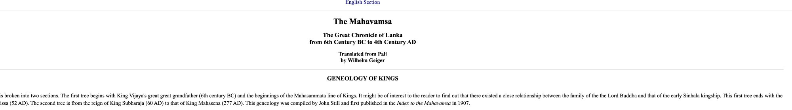
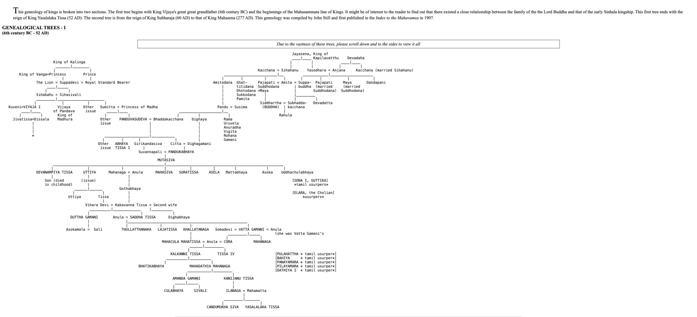
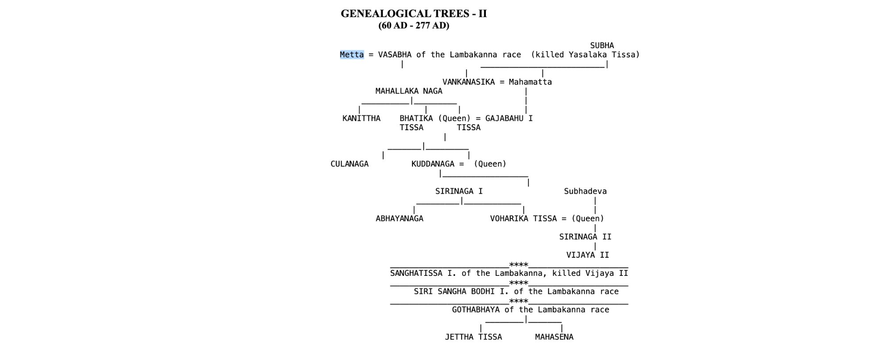

# Mahavamsa Genealogy Dataset

 **This dataset augments [soodoku/epic_children](https://github.com/soodoku/epic_children)** 
 The Mahavamsa data follows the same schema and can be appended directly to `epic_children.csv`.

Mahavamsa genealogical data extracted from the **Genealogical Trees of the Kings of Lanka**, compiled by John Still (1907) and published in the *Index to the Mahavamsa*. The authoritative text is Wilhelm Geiger's translation of the Mahavamsa from Pali (1912), with the English translation by Mabel Haynes Bode.

This dataset covers the two genealogy trees appended to the Mahavamsa (chapters 1–37), spanning from the legendary Mahasammata line of kings (6th century BC) through the reign of King Mahasena (277 AD).

## Wide vs Long Form

The dataset is in two formats:

**`mahavamsa_genealogy.csv`** — Wide form (one row per couple). This matches the `epic_children.csv` schema directly and can be concatenated with it. Sons and daughters are stored as comma-separated lists in the `sons` and `daughters` columns. This is the format used in the upstream repo.

**`epic_children_long.csv`** — Long form (one row per child). This is the **tidy-compliant** version of the full combined dataset (all 33 epics + mahavamsa). It satisfies the three tidy data rules:

1. **One observation per row** — each row is a single child
2. **One variable per column** — `child_name`, `child_sex`, and `child_order` are atomic
3. **One value per cell** — no comma-separated lists

The wide form is optimized for the core research question (sex ratio per couple) where each couple is the unit of analysis. The long form is better for child-level analysis, filtering by sex, or joining with other per-person datasets. The eventual hope is to create a person-level dataset with attributes like:

1. Hero's journey compliant (yes/no)
2. Weapon of choice
3. Superpowers (if any)
4. Wealth
5. Cause of death (battle, old age, curse, suicide, betrayal)
6. Manner of birth (natural, divine intervention, adopted)
7. Reign (if at all)
8. Role (king, warrior, sage, queen regnant, usurper, consort)
9. Avatar status (avatar of Vishnu, blessed by Shiva, etc.)
10. Exile or imprisonment (yes/no, duration)
11. Number of spouses
12. Importance (number of chapters/verses featuring them — a rough proxy for narrative importance)
13. Subsequent modern-day work based on this character (e.g., Mahabharata retold through Karna's lens, through Bheeshma's lens, etc.)
14. anything else?

| Format | Rows | Unit | Tidy? |
|---|---|---|---|
| Wide (mahavamsa only) | 64 | couple | No — `sons`/`daughters` columns hold multiple values |
| Long (all epics + mahavamsa) | 2,313 | child | Yes |

## Source Material

Original URL: budsas.org/ebud/mahavamsa/gene.html. In case the link rots, the relevant screenshots are preserved below.

### Genealogical Tree I (6th century BC – 52 AD)

The first tree begins with King Vijaya's great-great-grandfather and the Mahasammata line of kings. It traces the close relationship between the family of the Buddha and the early Sinhala kingship, ending with King Yasalalaka Tissa (52 AD).

### Genealogical Tree II (60 AD – 277 AD)

The second tree covers the Lambakanna dynasty from King Subharaja (60 AD) to King Mahasena (277 AD).

## Files

| File | Description |
|---|---|
| `mahavamsa_genealogy.csv` | Wide form — one couple per row, matches `epic_children.csv` schema |
| `epic_children_long.csv` | Long form (tidy) — one child per row, full combined dataset (33 epics + mahavamsa) |
| `mahavamsa_genealogy_codebook.md` | Variable definitions, validation summary, cleaning notes |
| `readme.md` | This file |
| `genealogy_tree_i.png` | Screenshot of Genealogical Tree I (6th c. BC – 52 AD) |
| `genealogy_tree_ii.png` | Screenshot of Genealogical Tree II (60 AD – 277 AD) |
| `genealogy_title.png` | Title page of the Geneology of Kings |

## Schema

Conforms to the cross-epic genealogy schema ([soodoku/epic_children](https://github.com/soodoku/epic_children/tree/main/data)). Namespace prefix: `mahavamsa::`.

### Wide form columns

| Column | Type | Description |
|---|---|---|
| `parents` | string | Couple label (e.g., "Vijaya I and Kuveni") or single parent name |
| `husband` | string | Male partner or patriarch |
| `wife` | string | Female partner; empty if unknown; "Queen" if unnamed |
| `husband_id` | string | Namespaced identifier (`mahavamsa::snake_case`) |
| `wife_id` | string | Namespaced identifier (`mahavamsa::snake_case`) |
| `n_sons` | numeric | Count of sons |
| `sons` | string | Comma-separated list of sons |
| `n_daughters` | numeric | Count of daughters |
| `daughters` | string | Comma-separated list of daughters |
| `n_unknown_sex` | numeric | Count of children of unspecified sex |
| `epic` | string | Tradition tag: `mahavamsa` |
| `source` | string | Textual citation (e.g., "Mahavamsa Ch.22") |
| `comments` | string | Contextual notes |
| `row_type` | categorical | `couple` or `usurper` |
| `historicity` | categorical | `legendary`, `semi-historical`, or `historical` |
| `family_id` | string | Reserved for cross-dataset linking |

### Long form columns (replaces sons/daughters)

| Column | Type | Description |
|---|---|---|
| `child_name` | string | Name of the child (empty if unnamed or childless couple) |
| `child_sex` | categorical | `male`, `female`, `unknown`, or empty |
| `child_order` | numeric | Birth order within the union (1-indexed) |

## Historicity Classification

- **Legendary** — Mythological and pre-historical figures (Mahasammata line, the Lion, the Buddha's Sakya dynasty). No independent corroboration.
- **Semi-historical** — Traditional dates with limited external evidence (Vijaya I through Mutasiva, the Ruhuna line of Gothabhaya and Kakavanna Tissa).
- **Historical** — Supported by inscriptions, external chronicles, or archaeological evidence (Devanampiya Tissa onward).

## Polygamy and Shared Wives

Three men in the dataset had multiple wives, each recorded as a separate row:

- **Kakavanna Tissa** — Vihara Devi (sons: Duttha Gamani, Saddha Tissa) and a Second Wife (son: Dighabhaya)
- **Vatta Gamani** — Somadevi (no children in tree) and Anula (son: Mahanaga/Cora)
- **Suddhodana** — Maya (son: Siddhartha/Buddha) and Pajapati (no children in tree)

One woman, **Anula** (wife of Mahacula Mahatissa), subsequently married **Cora** (Mahanaga). She appears in two rows with the same `wife_id`.

## Usurpers

Seven usurper entries are included as `row_type=usurper` with no genealogical links, matching their bracketed presentation in the original trees:

- Sena I and Guttika (Tamil, 237–215 BC)
- Elara the Cholian (205–161 BC)
- Pulahattha, Bahiya, Panayamara, Pilayamara, Dathiya I (Tamil, 103–89 BC)

## Key Relationships

The trees document the intersection of two major lineages:

1. **Sinhala royal line** — King of Kalinga → King of Vanga → The Lion → Sihabahu → Vijaya I → (via Pandu/Susima) Panduvasudeva → Pandukabhaya → Mutasiva → and onward through the Anuradhapura kings.
     - The Lion is Suppadevi's husband. Suppadevi is the daughter of the King of Wagu (Vanga in the csv) and the queen of Kalinga. When Suppadevi was born the astrolgers proclaimed "One day, this princess will marry a lion, for she possesses an unusually strong passion and desire.” https://www.srilankanz.co.nz/history/the-legend-of-sinhabahu-and-the-origin-of-vijaya-myths-facts-and-interpretations
       The Lion and Suppadevi's child is the legendary Sinhabahu (Sihabahu in the csv, literally meaning Lion Armed or the one who had arms like Lion). 

2. **Sakya/Buddhist line** — Jayasena (Mahasammata) → Sihahanu → Suddhodana → Siddhartha (the Buddha). Connected to the Sinhala line through Amitodana (son of Sihahanu, ancestor of Pandu) and Bhaddakacchana (Sakyan princess, wife of Panduvasudeva).

## Citation

Still, John. "Genealogical Trees of the Kings of Lanka." In *Index to the Mahavamsa*. 1907.

Geiger, Wilhelm, trans. *The Mahavamsa, or The Great Chronicle of Ceylon*. Translated from Pali. London: Pali Text Society, 1912. English translation by Mabel Haynes Bode.
