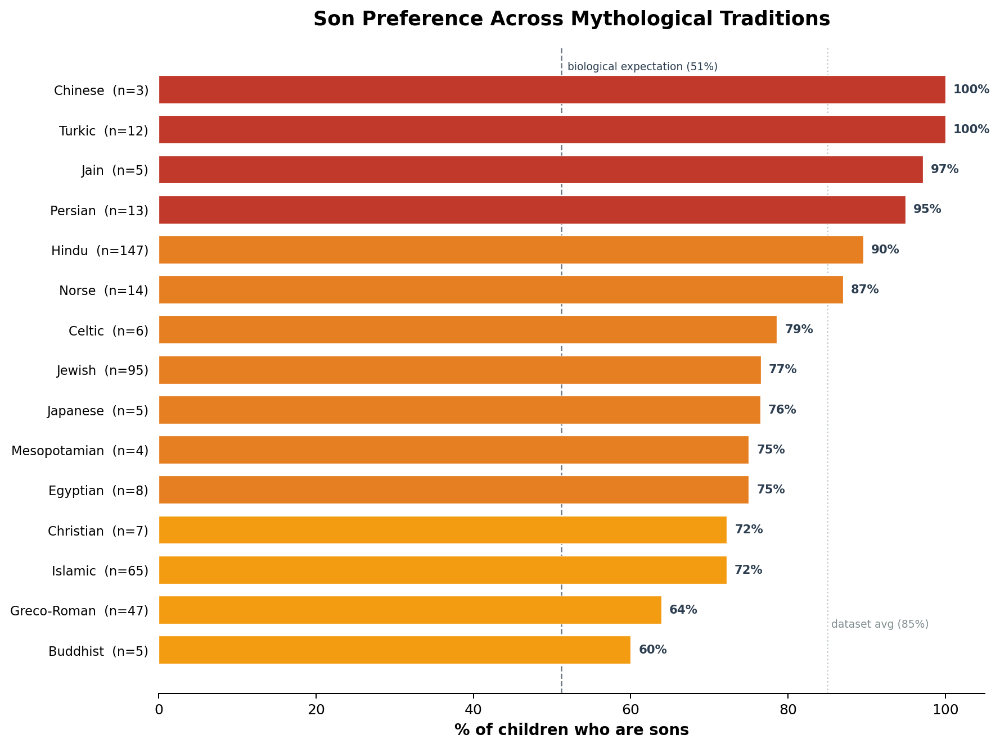
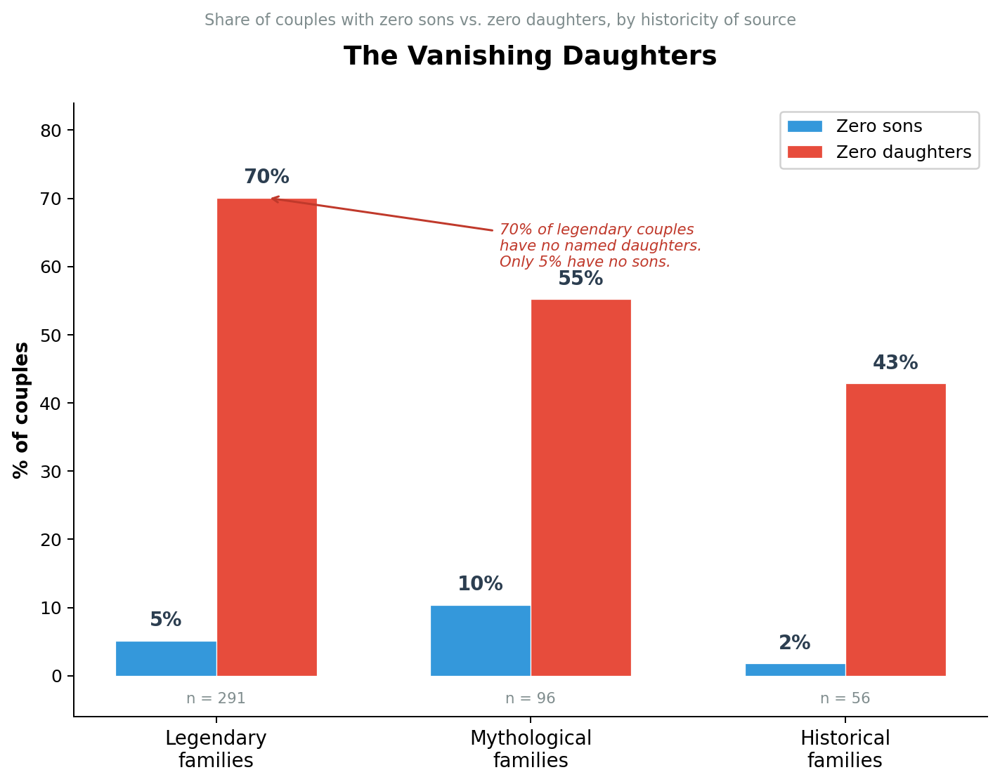

## Epic Children

Sex ratio of children of key characters across world mythological traditions.

Across 450 parent-child entries spanning 32 epics and 23 civilizations, 85% of named children are sons. The ratio varies by tradition — 97% male in Jain texts, 90% in Hindu, 77% in Jewish, 72% in Islamic, 64% in Greco-Roman — and by historicity: legendary figures are 88% male, but historically documented families are 68% male. 63% of couples have zero named daughters.

### Data

[epic_children.csv](epic_children.csv) — one row per parental unit.

Figures with multiple spouses are split into separate rows: Arjuna has four rows (one per wife), David eight, Krishna eight (five individually named queens from Bhagavata Purana 10.61), Ali seven, Abu Bakr four. Where the number of wives is known but per-wife attribution is not (Rehoboam's 16 unnamed wives, Hasan ibn Ali's ~7), we create per-wife rows with the average child count, tagged `avg_from_aggregate`.

**Columns:**

| Column | Description |
|---|---|
| `parents` | Both parents, format "X and Y". Where spouse unknown: "(wife unnamed)". |
| `husband` | Husband name. `unknown` if unnamed, `multiple` if wife count unknown, `none` if parthenogenesis. |
| `wife` | Wife name. `unknown` if unnamed, `multiple` if husband count unknown, `none` if parthenogenesis. |
| `husband_id` | Stable ID, format `epic::name`. Same person across rows gets same ID. Blank for unknown/none/multiple. |
| `wife_id` | Stable ID, format `epic::name`. |
| `n_sons` | Number of sons (may be fractional for `avg_from_aggregate` rows) |
| `sons` | Names of sons |
| `n_daughters` | Number of daughters (may be fractional for `avg_from_aggregate` rows) |
| `daughters` | Names of daughters |
| `n_unknown_sex` | Children of unknown sex |
| `epic` | Source tradition (e.g., `mahabharat`, `hebrew_bible`, `islam`, `greek`) |
| `source` | Primary textual source with chapter/verse |
| `comments` | Attribution notes, variant traditions, adoptive vs. biological |
| `row_type` | Data quality flag (see below) |
| `historicity` | `mythological`, `legendary`, or `historical` |
| `family_id` | Links cross-tradition parallels for deduplication |

### Row Types

Every row carries a `row_type` flag. Analysts should filter or weight accordingly.

| Type | N | Meaning | Handling |
|---|---|---|---|
| `couple` | 321 | Both parents named, clean attribution | Use directly |
| `spouse_unnamed` | 69 | Couple, but spouse absent from primary sources | Use; note limitation |
| `avg_from_aggregate` | 27 | Per-wife row created from a known aggregate: n_wives known, children divided equally. Counts may be fractional (e.g., 1.5 sons). | Use for couple-level analysis; fractional counts are averages |
| `cross_tradition` | 15 | Derivative tradition retelling the same family (Roman ≈ Greek, Quran ≈ Hebrew Bible). Primary-tradition rows keep their natural type but carry a `family_id`. | Exclude to avoid double-counting, or use `family_id` to pick one tradition per family |
| `single_divine` | 8 | Parthenogenesis, mind-born, or divine invocation without consort | Flag as non-biological if needed |
| `mythical_count` | 7 | Total children ≥ 100 (Kauravas 101, Kadru 1,002, Sagara 60,001) | Cap or exclude; we cap at 200 in ratio calculations |
| `multi_wife_agg` | 3 | Children from multiple wives lumped together; wife count unknown, so per-wife splitting impossible | Use with caution; inflates apparent son count |

### Historicity

Not all rows have the same evidentiary status. Muhammad's children are as well-documented as any 7th-century family. Arjuna's are literary inventions. David probably existed (Tel Dan stele, ~840 BCE), but the stele doesn't validate 1 Chronicles 3 — his specific wife-and-children list comes from texts compiled centuries later, same genre as Abraham's.

| Level | N | Definition | Examples |
|---|---|---|---|
| `mythological` | 98 | Gods, cosmic beings, no human historicity claimed | Zeus, Brahma, Odin, Ra, Kashyapa, Izanagi |
| `legendary` | 296 | Human figures in epic/religious texts; no independent corroboration of family details | Arjuna, Rama, Abraham, David, Moses, Achilles, Rostam, Buddha |
| `historical` | 56 | Family documented by near-contemporaneous sources | Muhammad, Abu Bakr, Ali, Mu'awiya, Herod the Great (Josephus) |

**Sex ratio by historicity:**

| Level | Rows | Sons | Daughters | % Male |
|---|---|---|---|---|
| Legendary | 296 | 1,501 | 199 | **88%** |
| Mythological | 98 | 608 | 136 | **82%** |
| Historical | 56 | 101 | 48 | **68%** |

The gap between 88% and 68% is the storyteller's thumb on the scale.

### Cross-Tradition Parallels

The `family_id` column links families that appear in multiple traditions. 15 unique IDs cover Greek ≈ Roman pairs (`titan_parents`, `sky_king_queen`, `sea_god`, `underworld`, `love_war`, etc.) and Hebrew Bible ≈ Quran pairs (`abraham`, `noah`, `lot`, `david`, `solomon`, `jacob`, `amram_moses`). Primary-tradition rows keep their natural `row_type`; derivative rows are tagged `cross_tradition`. To deduplicate: filter on `row_type != 'cross_tradition'`.

### Analysis

Run `python analyze.py` to reproduce all summary statistics and plots:

```
python analyze.py                      # reads epic_children.csv
python analyze.py path/to/file.csv     # reads specified file
```

The script produces: sex ratio by tradition, by historicity, row type distribution, partner multiplicity (wives per husband), children-per-couple distribution, and two plots. Key findings:





Key numbers from the distribution analysis:

- **Median children per couple: 2.** Mean: 3.8 (skewed by a few large families).
- **43% of couples have exactly 1 child.** 63% have 1–2.
- **Mean sons per couple: 2.9. Mean daughters: 0.9.**
- **63% of couples have zero named daughters.** Only 6% have zero sons.
- **90% of figures appear with a single partner.** The most-partnered figures: Rehoboam (18 wife-rows), Ali (10), David (8), Krishna (8), Zeus (7).

### Sex Ratio by Tradition

Sons capped at 200 per parent to exclude mythical inflation. Only traditions with >10 rows shown; 15 smaller traditions (Egyptian, Christian, Celtic, Jain, Japanese, Buddhist, Mesopotamian, Armenian, Chinese, Arthurian, Maya, W. African, Finnish, Tibetan, Hindu Tamil) contribute 57 rows total.

| Tradition | Rows | Sons | Daughters | % Male |
|---|---|---|---|---|
| Hindu | 147 | 1,220 | 142 | 90% |
| Jewish | 95 | 372 | 114 | 77% |
| Islamic | 65 | 135 | 52 | 72% |
| Greco-Roman | 47 | 69 | 39 | 64% |
| Norse | 14 | 20 | 3 | 87% |
| Persian | 13 | 94 | 5 | 95% |
| Turkic | 12 | 18 | 0 | 100% |
| **Total** | **450** | **2,210** | **383** | **85%** |

### Methodology

**Unit of observation.** One row = one couple (or one divine parent). Multi-partner figures are split by spouse wherever sources permit. Where per-wife child counts are known, each wife gets her own row (Krishna's 8 queens, Ali's 7 named wives). Where the total is known but not the per-wife breakdown, we create per-wife rows with the average, tagged `avg_from_aggregate` — Rehoboam's 16 unnamed wives each get a row with 1.5 sons and 3.75 daughters (= 24 and 60 divided by 16). Where the wife count itself is unknown (Gideon's "many wives"), the row stays aggregated as `multi_wife_agg`.

**Deduplication.** Every named child in the Hindu epics was verified to appear in exactly one row. Overlapping single-parent entries were merged into couples (Agni + Svaha, Balarama + Revati). Summary rows were removed when couple-level rows exist (Satyavati → Parasara + Satyavati and Shantanu + Satyavati).

**Biological vs. adoptive.** Niyoga births attributed to the biological father (Vyasa, not Vichitravirya). Karna appears twice: biological (Surya + Kunti) and adoptive (Adhiratha + Radha).

**Historicity.** Three levels. The boundary is the evidentiary status of the *family details*: David is `legendary` because the Tel Dan stele says nothing about Bathsheba or Absalom. Muhammad is `historical` because his family is documented by multiple historians within 130–210 years, with independent chains of transmission.

**What the male skew means.** The 85% reflects what storytellers chose to record, not demography. The historicity gradient confirms this: legendary 88%, historical 68%. When real families are documented, daughters appear at near-biological rates. When families are invented, daughters vanish. The traditions with the highest male ratios (Jain, Persian, Hindu) are those where sons drive inheritance and succession. The traditions with lower ratios (Islamic hadith, Greco-Roman mythology) either document families systematically or give women independent narrative roles.

**The Rehoboam test.** The Jewish sex ratio dropped from 90% to 77% when we added Rehoboam's 60 daughters (2 Chronicles 11:21) and Ibzan's 30 daughters (Judges 12:8-9) — two of the only passages in the Hebrew Bible that explicitly count daughters. The daughters were always in the text. They just were not in anyone's dataset.

### Coverage

32 epics, 23 civilizations, 450 rows. Hindu (7 epics, 147 rows); Jewish (95 rows — patriarchs, Table of Nations, tribal sons, Levitical lineage, Judges, Kings); Islamic (65 rows — Prophet's lineage, Rashidun caliphs, Twelve Imams, Umayyads, companions, Quran); Greco-Roman (47 rows); Norse (14); Persian (13); and 12 other traditions (101 rows).

### Sources

Mahabharata; Ramayana (Valmiki); Bhagavata Purana; Vishnu Purana; Shiva Purana; Hebrew Bible; Quran; al-Tabari; Ibn Sa'd (Tabaqat); Ibn Hisham (Sirah); Sahih al-Bukhari; Sahih Muslim; al-Kulayni (Usul al-Kafi); al-Mufid (Kitab al-Irshad); Hesiod (Theogony); Apollodorus (Bibliotheca); Homer; Ovid; Virgil; Josephus (Antiquities); Prose Edda; Poetic Edda; Ferdowsi (Shahnameh); Kojiki; Dede Korkut; Kalevala; Popol Vuh; Sundiata (Niane); Jinasena (Adi Purana); Ashvaghosha (Buddhacarita).
